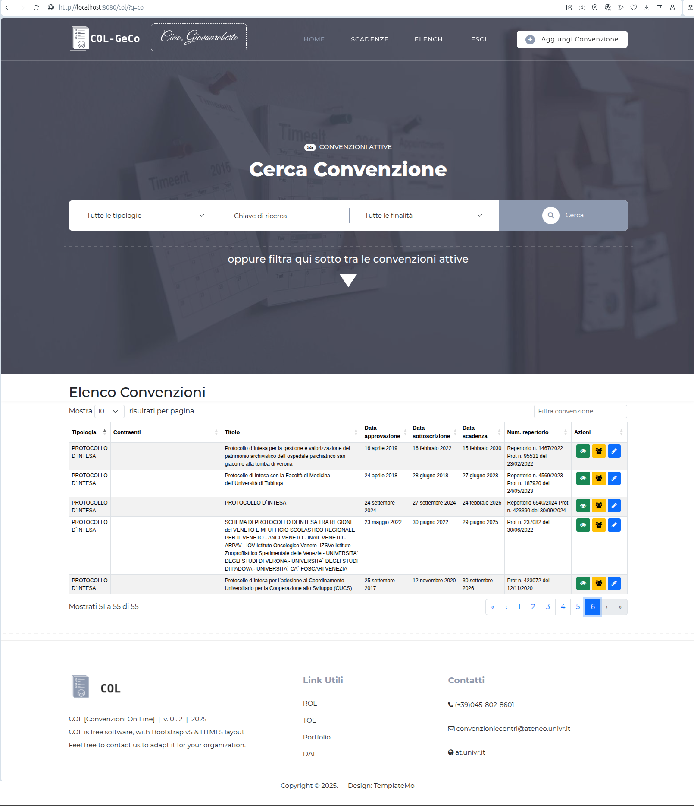
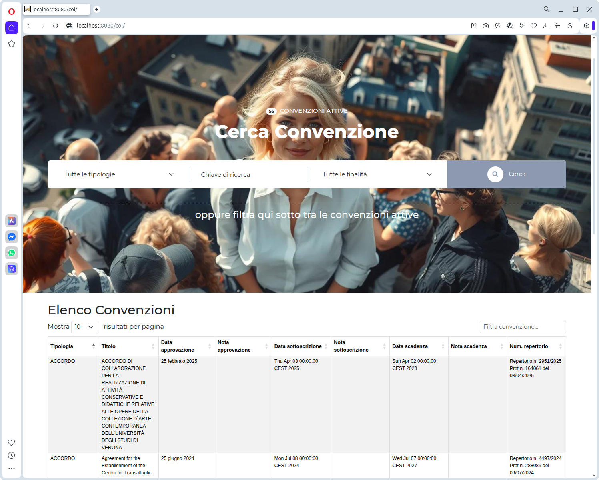

### Lingue
[](https://github.com/gbetorre/convenzioni/blob/master/README.md)
[](https://github.com/gbetorre/convenzioni/blob/master/README.it.md)

---

[](https://github.com/gbetorre/convenzioni/blob/main/LICENSE)

<div align="center">
  <h3 align="center">COL-GeCo</h3>
  
  <p align="center">
    Applicazione web per la gestione e il monitoraggio delle convenzioni della pubblica amministrazione.
    <br><br>
    <a href="https://github.com/gbetorre/convenzioni"><strong>Esplora i files »</strong></a>
    <br><br>
    <a href="https://github.com/gbetorre/convenzioni/issues">Report Bug</a>
    ·
    <a href="https://github.com/gbetorre/convenzioni/pulls">Request Feature</a>
  </p>
</div>

# Software di Gestione delle convenzioni [COL-GeCo]

Il software gestionale delle convenzioni (COL-GECO, ovvero Convenzioni On Line-Gestione Convenzioni) è un software modulare 
che nasce dall’esigenza, interna alla Pubblica Amministrazione, di tracciare convenzioni, accordi quadro, società partecipate, 
collegi direttivi e ogni altro tipo di accordo e convenzione intercorrente tra soggetti esterni e la PA stessa, 
sia allo scopo di redigere un registro organizzato e sempre aggiornato, sia al fine di ottenere uno scadenzario atto 
a informare e notificare circa le prossime convenzioni in scadenza e in grado di erogare riepiloghi mensili e fornire 
remind riguardo le scadenze imminenti.

## Riguardo la modularità



**_Fig.1 - Pagina di landing, versione 0.2_**

Il primo dominio informativo, oggetto dello sviluppo iniziale, è relativo alle convenzioni, ma il software è concepito 
con la mission di estendere progressivamente il dominio agli altri soggetti, di fatto e di diritto, che intraprendono 
contratti e accordi con la PA.

Il software è progettato in maniera modulare, allo scopo di essere adattabile a qualunque amministrazione che sia 
interessata a dotarsi di uno scadenzario Open Source.<br>
Inoltre, le modalità tramite cui il software avvisa circa scadenze e riepiloga le attività, possono estendersi 
a varie modalità: 

* ✉️ e-mail 
* 📆 calendario condiviso 
* 💬 notifiche push 
* 📂 riepiloghi periodici creati in automatico in percorsi condivisi 
* ⬇️ anche scaricabili on-demand in base all’input dell’utente<br>
e così via.

# In sintesi

✔️ modulare<br>
✔️ semplice e chiaro<br>
✔️ customizzabile<br>
✔️ compliance GDPR<br>
❌ non può essere applicato da utenti inesperti (è necessario un minimo di consulenza iniziale).



**_Fig.2 - Pagina di landing, versione 0.1_**

# Caratteristiche

Perché sviluppare un software ex-novo, anziché basarsi su strumenti già esistenti e disponibili, alcuni dei quali gratuitamente?

Di seguito possiamo delineare una serie di motivi:

1. **per effettuare la gestione degli oggetti del dominio (p.es. le convenzioni) sono necessari più strumenti in contemporanea**, 
come ad esempio: 
* 🧮 foglio di calcolo (spreadsheet)
* 📆 calendario condiviso 
* ✉️ gestore di posta elettronica.

Originariamente, la richiesta di sviluppare un software ad-hoc è partita proprio dall’esigenza degli uffici, che non trovavano sufficiente appoggiarsi ad uno strumento predefinito, 
come ad esempio il Google Calendar o il calendario di Outlook, in quanto già utilizzavano tipicamente, oltre a questi strumenti, le cartelle Excel per gestire le convenzioni. 

Un software come ``COL-GECO`` rappresenta un hub unico in cui, una volta inserite le informazioni relative, ad esempio, alle convenzioni, tutto il workflow procede di conseguenza e senza necessità di ulteriore intervento da parte degli operatori.

2. **I software a pagamento che offrono soluzioni gestionali analoghe** esistono e, talvolta, sono ben fatti; 
tuttavia, **richiedono comunque un periodo di apprendimento dell’interfaccia e delle funzionalità da parte 
degli operatori degli uffici e, inoltre, richiedono una configurazione ad hoc da parte delle ditte fornitrici**, 
oppure un’expertise specifica nel caso degli strumenti gratuiti. 

Il software ``COL-GECO`` è sviluppato in Open Source per permettere a chiunque di poterne usufruire e godere degli aggiornamenti futuri, 
se piace, senza necessità di pagare abbonamenti o stipulare contratti. 

Inoltre, è stato specificamente disegnato per essere il più semplice ed intuitivo possibile, ed il suo uso può essere appreso in una singola sessione.

3. Gli strumenti gratuiti e ben realizzati sono generalmente sviluppati da aziende americane e **i dati personali 
e delle amministrazioni in essi caricati non sono ben tracciati e controllati, avendo possibili risvolti negativi 
in termini di privacy e trattamento dei dati personali.** 
Nel software bisogna caricare i dati personali della pianta organica dell’ateneo o della amministrazione in generale 
e questi dati potrebbero essere trattati non in conformità con le normative europee. 

Il software ``COL-GECO`` è compliant con il GDPR e offre una tutela aggiuntiva rispetto al trattamento dei dati personali.

4. Se i motivi riportati sopra non fossero sufficienti, si considerari che **il software può essere scaricato e provato 
senza impegno alcuno e se ne può creare un’istanza al fine di verificare se l’interfaccia e le funzionalità sono in linea 
con quanto richiesto** e con quanto ci si aspetta ai fini della gestione ottimale delle convenzioni e degli altri elementi affini.

L’estrema modularità e la semplicità di uso sono obiettivi che, a dispetto del risultato, sono spesso ardui da realizzare 
e richiedono uno sforzo continuo da parte dello sviluppatore. Se questo progetto incontra il vostro favore, assegnategli 
una stella (se avete un utente GitHub e siete loggati) o quanto meno fornite un feedback o inviate un’e-mail al software engineer, che vi ringrazia in anticipo.

Inoltre, qualunque esigenza specifica e o richiesta di documentazione ulteriore rispetto a questo documento è benvenuta e riceverà risposta.

# Caratteristiche tecniche

Il software è un'applicazione Java three-tier 

## Schema Concettuale


**_Fig.3 - Diagramma Entit&agrave;-Relazione_**

## Progettazione fisica


**_Fig.4 - Modello fisico_**

# History

```
* [0.4.9] (Jan 13, 2026) Bugfix
* [0.4.8] (Dec 04, 2025) Completamento implementazione modifica convenzione
* [0.4.7] (Dec 03, 2025) Continuazione implementazione modifica convenzione
* [0.4.6] (Dec 02, 2025) Prima bozza implementazione modifica convenzione
* [0.4.5] (Nov 28, 2025) Implementate voci dell'header dinamiche
* [0.4.4] (Nov 26, 2025) Implementati controlli sui diritti di visualizzazione dei dettagli di una convenzione
* [0.4.3] (Nov 25, 2025) Implementata generazione elenco contraenti
* [0.4.2] (Nov 24, 2025) Puntamento librerie in locale
* [0.4.1] (Nov 20, 2025) Migliorie di presentazione
* [0.4.0] (Nov 19, 2025) Implementata pagina dettagli contraente
* [0.3.9] (Nov 18, 2025) Migliorie di presentazione; aggiornate librerie
* [0.3.8] (Nov 17, 2025) Implementato motore di ricerca full text
* [0.3.7] (Nov 13, 2025) Aggiunte informazioni relative alle finalità delle convenzioni
* [0.3.6] (Nov 11, 2025) Aggiunte informazioni relative al pagamento delle imposte di bollo
* [0.3.5] (Nov 05, 2025) Selezione convenzioni considerando tutti i gruppi di appartenenza dell'utente loggato
* [0.3.4] (Oct 30, 2025) Aggiunto cookie banner
* [0.3.3] (Oct 29, 2025) Migliorie di presentazione
* [0.3.2] (Oct 28, 2025) Prima bozza implementazione e-mail riepilogativa delle scadenze
* [0.3.1] (Oct 15, 2025) Implementato range temporale nell'estrazione convenzioni
* [0.3.0] (Oct 14, 2025) Prima bozza implementazione ricerca
* [0.2.9] (Oct 13, 2025) Bugfix
* [0.2.8] (Oct 10, 2025) Prima bozza implementazione scadenziario
* [0.2.7] (Oct 09, 2025) Implementata pagina dettagli convenzione
* [0.2.6] (Oct 08, 2025) Assegnazione contraenti a convenzione: visualizzati contraenti già assegnati
* [0.2.5] (Oct 06, 2025) Continuazione funzione di assegnazione contraenti a convenzione: scrittura relazioni nel db
* [0.2.4] (Oct 02, 2025) Prima bozza funzione di assegnazione contraenti a convenzione
* [0.2.3] (Oct 01, 2025) Implementata selezione delle convenzioni in funzione del gruppo dell'utente loggato
* [0.2.2] (Sep 30, 2025) Implementata generazione elenco tipi e finalità delle convenzioni
* [0.2.1] (Sep 29, 2025) Migliorie di presentazione
* [0.2.0] (Sep 25, 2025) Migliorie di presentazione
* [0.1.9] (Sep 24, 2025) Prima bozza implementazione assegnazione contraenti a una convenzione
* [0.1.8] (Sep 23, 2025) Implementato nuovo componente dello strato controller (Command) per la gestione delle convenzioni
* [0.1.7] (Sep 22, 2025) Bugfix
* [0.1.6] (Sep 18, 2025) Implementato footer
* [0.1.5] (Sep 16, 2025) Implementato messaggio di benvenuto post-login
* [0.1.4] (Sep 15, 2025) Implementata generazione elenco convenzioni in pagina di landing
* [0.1.3] (Sep 12, 2025) Prima bozza estrazione convenzioni
* [0.1.2] (Sep 10, 2025) Implementata pagina di errore
* [0.1.1] (Sep 05, 2025) Implementata login
* [0.1.0] (Aug 29, 2025) Add README.it and logo
* [0.0.9] (Aug 28, 2025) Add neumorphism login form
* [0.0.8] (Aug 07, 2025) Bugfix
* [0.0.7] (Aug 06, 2025)
* [0.0.6] (Jul 24, 2025)
* [0.0.5] (Jul 22, 2025)
* [0.0.4] (Jul 21, 2025)
* [0.0.3] (Jul 14, 2025)
* [0.0.2] (Jul 10, 2025)
* [0.0.1] (Jul 02, 2025)
```
