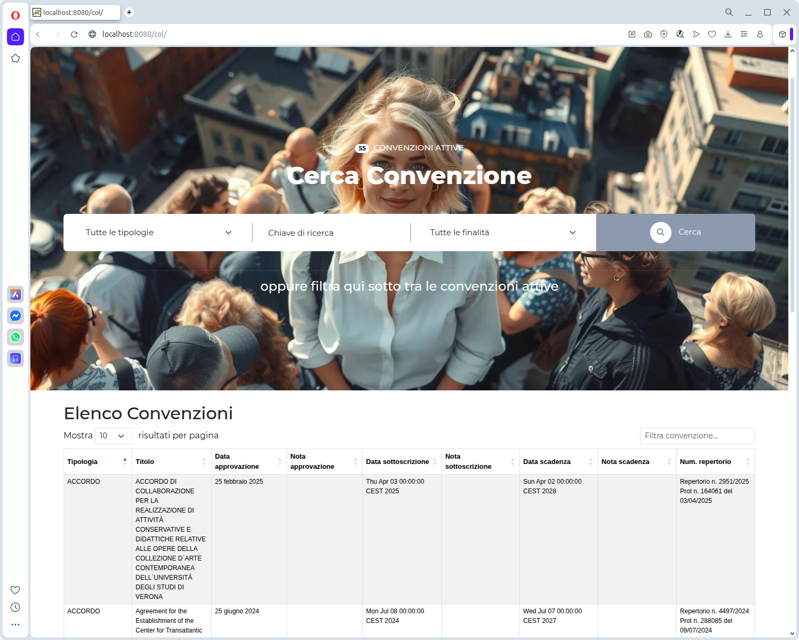

### Lingue
[](https://github.com/gbetorre/convenzioni/blob/master/README.md)
[](https://github.com/gbetorre/convenzioni/blob/master/README.it.md)

---

[](https://github.com/gbetorre/convenzioni/blob/main/LICENSE)

<div align="center">
  <h3 align="center">COL-GeCo</h3>
  
  <p align="center">
    Web application to trace, and manage, the government conventions.
    <br><br>
    <a href="https://github.com/gbetorre/convenzioni"><strong>Explore files »</strong></a>
    <br><br>
    <a href="https://github.com/gbetorre/convenzioni/issues">Report Bug</a>
    ·
    <a href="https://github.com/gbetorre/convenzioni/pulls">Request Feature</a>
    ·
    <a href="https://github.com/gbetorre/convenzioni/blob/master/README.it.md">Need Italian?&nbsp;</a>
  </p>
</div>

# COL-GeC(k)o

The convention management software (COL-GECO) is a modular software that arose from the need, within the public administration, 
to track agreements, framework agreements, investee companies, management boards, and any other type of agreement 
between external parties and the public administration itself.

The goal is to create an organized and constantly updated register: 
1. to obtain a schedule for informing and notifying users about upcoming agreements that are about to expire; 
2. to be able to provide monthly summaries and reminders about upcoming deadlines.

## Regarding modularity



**_Fig.1 - Landing page, version 0.1_**

The main information domain, which is the subject of the initial development, relates to conventions, but the software 
is designed to gradually extending the domain to other entities, which deal with the public administration.

The software is designed in a modular way, so that it can be adapted to any administration interested in adopting an open source schedule.

Moreover, the ways in which the software alerts you to deadlines and summarizes activities can be extended to several modalities:
<!--
# In a nutshell

I ment to achieve 
-->
## 

The software is not ready yet: please, let me cook.

When will be ready, I will release, package or tag


# E-R


**_Fig.2 - Entity-Relationships diagram_**

# History

```
* [0.2.8] (Oct 10, 2025) First implementation scheduler
* [0.2.7] (Oct 09, 2025) Implementation agreement details page
* [0.2.6] (Oct 08, 2025) Implementation assignment contractors to an agreement: show contractors already bound
* [0.2.5] (Oct 06, 2025) Implementation assignment contractors to an agreement: db persistence
* [0.2.4] (Oct 02, 2025) First draft of the function for assigning contractors under agreement
* [0.2.3] (Oct 01, 2025) Implemented dynamic subset of agreements based on user membership
* [0.2.2] (Sep 30, 2025) Implemented dynamic generation of dropdown lists
* [0.2.1] (Sep 29, 2025) Presentation improvements
* [0.2.0] (Sep 25, 2025) Presentation improvements
* [0.1.9] (Sep 24, 2025) First implementation assignment contractors to an agreement
* [0.1.8] (Sep 23, 2025) Delegated convention management (viewing, entering, updating and so on) to a new controller component (Command) 
* [0.1.7] (Sep 22, 2025) Bugfix
* [0.1.6] (Sep 18, 2025) Implemented footer
* [0.1.5] (Sep 16, 2025) Implemented post-login welcome back message
* [0.1.4] (Sep 15, 2025) Implemented dynamic agreements list in landing page
* [0.1.3] (Sep 12, 2025) First draft of agreements extraction
* [0.1.2] (Sep 10, 2025) Implement error page
* [0.1.1] (Sep 05, 2025) Implement login
* [0.1.0] (Aug 29, 2025) Add README.it and logo
* [0.0.9] (Aug 28, 2025) Add neumorphism login form
* [0.0.8] (Aug 07, 2025) Bugfix
* [0.0.7] (Aug 06, 2025)
* [0.0.6] (Jul 24, 2025)
* [0.0.5] (Jul 22, 2025)
* [0.0.4] (Jul 21, 2025)
* [0.0.3] (Jul 14, 2025)
* [0.0.2] (Jul 10, 2025)
* [0.0.1] (Jul 02, 2025)
```
